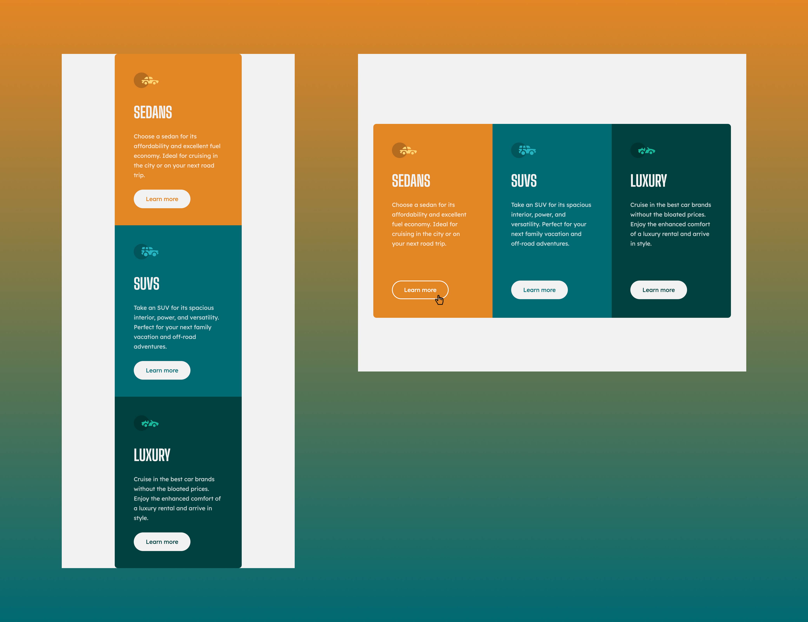

# Frontend Mentor - 3-column preview card component solution

This is a solution to the [3-column preview card component challenge on Frontend Mentor](https://www.frontendmentor.io/challenges/3column-preview-card-component-pH92eAR2-). Frontend Mentor challenges help you improve your coding skills by building realistic projects. 

## Table of contents

- [Overview](#overview)
  - [The challenge](#the-challenge)
  - [Screenshot](#screenshot)
  - [Links](#links)
- [My process](#my-process)
  - [Built with](#built-with)
  - [What I learned](#what-i-learned)
  - [Useful resources](#useful-resources)
- [Author](#author)

## Overview

### The challenge

Users should be able to:

- View the optimal layout depending on their device's screen size
- See hover states for interactive elements

### Screenshot



### Links

- Solution URL: [https://github.com/LucLhote/3-column-preview-card-component-challenge](https://github.com/LucLhote/3-column-preview-card-component-challenge)
- Live Site URL: [https://luclhote.github.io/3-column-preview-card-component-challenge/](https://luclhote.github.io/3-column-preview-card-component-challenge/)

## My process

### Built with

- Semantic HTML5 markup
- CSS custom properties
- Flexbox
- CSS Grid
- Mobile-first workflow

### What I learned

To achieve this design, adding an h1 level title didn't seem necessary. After submitting my work, I saw that I had an accessibility issue and the page needed an h1 title. So I added a title and hid it with CSS using the ``display`` property and the ``none`` value. I figured out that this value hides the title also from screen reader users, so I tried to find a solution online and found this article: [Page Title - H1 - Best Practices](https://wdn.unl.edu/page-title-h1-best-practices)

One of the proposed solutions was the following:
```css
h1 {
  font-size: 0;
  width: 1px;
  height: 1px;
  display: inline-block;
  overflow: hidden;
  position: absolute!important;
  border: 0!important;
  padding: 0!important;
  margin: 0!important;
  clip: rect(1px,1px,1px,1px);
}
```

I adapted this vision with my code and it worked.

### Useful resources

- [Page Title - H1 - Best Practices](https://wdn.unl.edu/page-title-h1-best-practices) - This helped me figure out how to visually hide the h1.

## Author

- Email - [luc.lhote@outlook.com](luc.lhote@outlook.com)
- Frontend Mentor - [@LucLhote](https://www.frontendmentor.io/profile/LucLhote)
- LinkedIn - [Luc Lhote](https://www.linkedin.com/in/luclhote/)
- freeCodeCamp - [@LucLh](https://www.freecodecamp.org/LucLh)
- freeCodeCamp Forum - [@LucLh](https://forum.freecodecamp.org/u/luclh/summary)